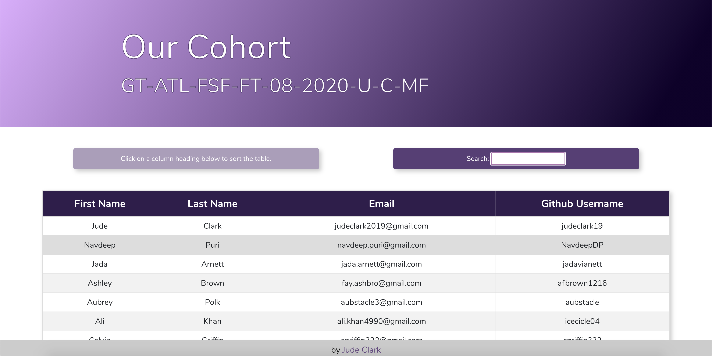

# User Data Table

Deployed site: https://judeclark19.github.io/user-data-table

This table built using react and [react-table](https://react-table.tanstack.com/) shows the contact info of myself and my classmates from GA Tech's full stack coding Bootcamp in October 2020. Click on any column header to sort the table by that column. Type anything in the search input to filter the table.

---

## Special Thanks

Thank you very much to [@gopinav](https://github.com/gopinav) for your wonderful [react-table tutorial series on YouTube](https://www.youtube.com/playlist?list=PLC3y8-rFHvwgWTSrDiwmUsl4ZvipOw9Cz)
which is the source of most of the code in this repo.

## License

